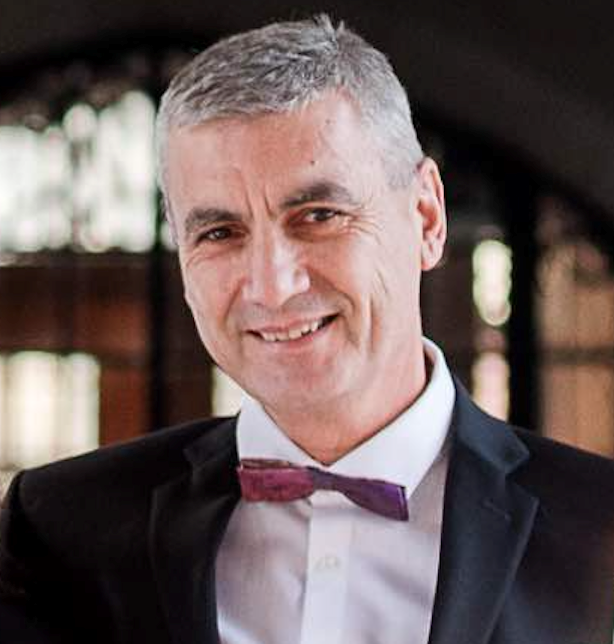
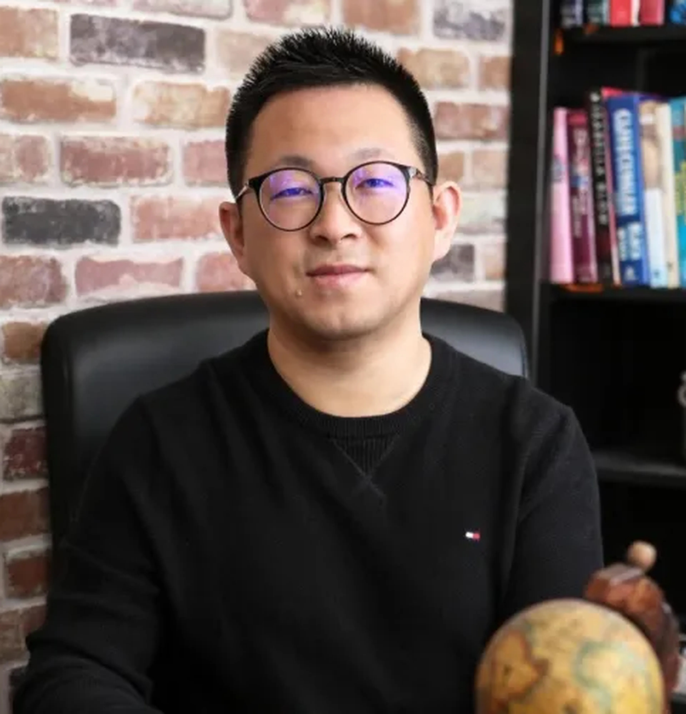
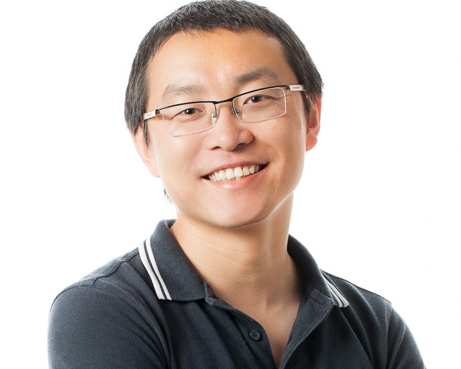
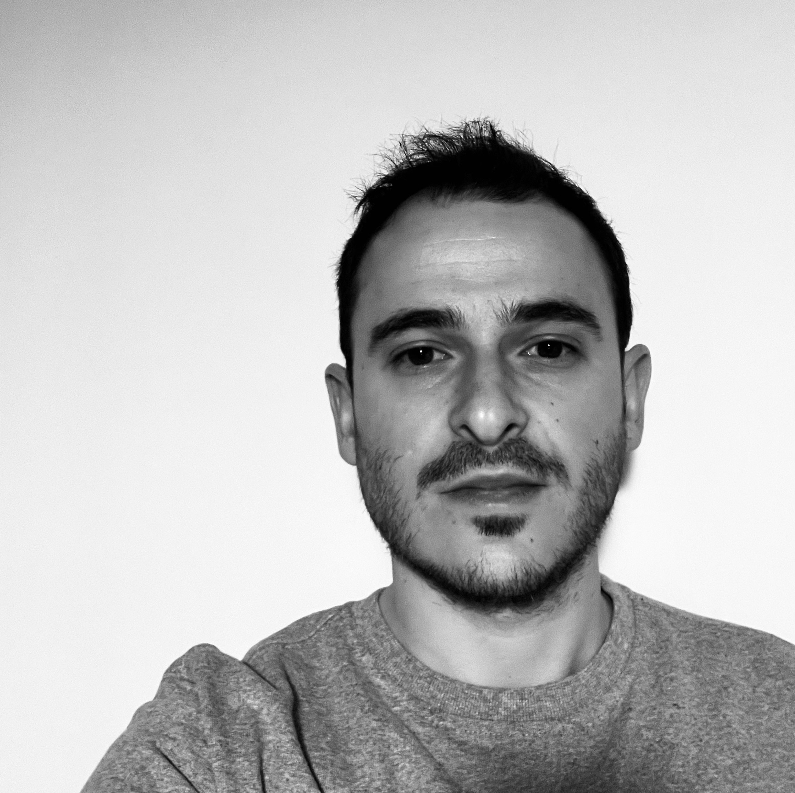

## Green Intelligence: Sustainable Development and Operations of Intelligent Systems

## A warm welcome from the organizers (in alphabetical order)!
<!-- 
- Heng Li, Polytechnique Montréal
- Marin Litoiu, York University
- Lei Ma, The University of Tokyo
- Weiyi Shang, University of Waterloo
- Luca Traini, University of L’Aquila
-->

<table>
  <tr>
    <td align="center">
       
      <b>Heng Li</b> 
      <i>Polytechnique Montréal</i>
    </td>
    <td align="center">
       
      <b>Marin Litoiu</b> 
      <i>York University</i>
    </td>
    <td align="center">
       
      <b>Lei Ma</b> 
      <i>University of Tokyo</i>
    </td>
    <td align="center">
       
      <b>Weiyi Shang</b> 
      <i>University of Waterloo</i>
    </td>
    <td align="center">
       
      <b>Luca Traini</b> 
      <i>University of L’Aquila</i>
    </td>
  </tr>
</table>

## Meeting goal

The broad influence of Artificial Intelligence (AI) and Machine Learning (ML) has led to a massive new software paradigm of Intelligent systems. Significant parts of these systems are either based on AI or generated by AI (i.e., AIWare). Among the various key attributes of research and industry pursuit of governance and regulation of intelligent systems, sustainability is becoming a critical factor. In particular, the ever-growing energy consumption and carbon emissions from AI-based software play a central role in the sustainability of intelligent systems, from large-scale data centers to personal devices. Thus, improving the energy efficiency of the software is critical for reducing the energy footprint of intelligent systems and contributing to sustainable development.

The goal of the meeting is to bring together software engineering, performance and AI experts from academia and industry, featuring and taking a special focus on the sustainability of intelligent systems, to discuss how to design new engineering practices, especially for intelligent systems that would allow for effective engineering of an AI-based system in a more energy-efficient way. The long-term goal is to make the activities across the whole development lifecycle of intelligent systems sustainable (Green Intelligent Systems Engineering) as it is nowadays for traditional software. The community of AIWare and green software has grown rapidly in the past few years, with some early-stage results by researchers around the world. We envision a meeting that gathers the world-leading researchers and industry practitioners who have achieved important results over the past few years. The meeting will enable further exchange of state-of-the-art ideas and practices and techniques, promote sustainability as an important research direction, and emphasize its potential industrial applications, thereby contributing to the current urgent demand for sustainable intelligent systems.

## Presentation slides & meeting notes
- Kindly upload your presentation slides to this Google Drive [folder](https://drive.google.com/drive/folders/18EFSCfIbQUeRI87K-hK12WrGjGtDWfmV?usp=sharing).
- Kindly contribute to the meeting notes in this [folder](https://drive.google.com/drive/folders/1WmJDlW6Zuz8PfGHXixPbiIDBwAZeUZR6?usp=sharing).

## Participants (in alphabetical order)

| Data/Time             | Theme/Session                                                                                                                       |
| --------------------- | ----------------------------------------------------------------------------------------------------------------------------------- |
| __Sunday 30 August__      | __Arrival__                                                                                                                             |
| 15:00 onwards         | Check-in                                                                                                                            |
| 19:00-21:00           | Welcome Banquet                                                                                                                     |
|                       |                                                                                                                                     |
| Monday 31 August      | Day 1: Introduction                                                                                                                 |
| 8:30-9:00             | Pre-meeting with Shonan staff                                                                                                       |
| 9:00-9:10             | Introduction movie of NII Shonan Meeting                                                                                            |
| 9:10-10:30            | 2-min participant introduction (one slide): reserach interest & proposed discussion topics                                          |
| 10:30-11:00           | Break                                                                                                                               |
| 11:00-12:00           | Invited presentations & discussions (2 presentations)                                                                               |
| 12:00-13:30           | Lunch                                                                                                                               |
| 13:30-14:00           | Group Photo Shooting                                                                                                                |
| 14:00-15:30           | Invited presentations & discussions (3 presentations)                                                                               |
| 15:30-16:00           | Break                                                                                                                               |
| 16:00-17:30           | Invited presentations & discussions (3 presentations)                                                                               |
| 17:30-18:00           | Wrap-up of Day 1                                                                                                                    |
| 18:00-19:30           | Dinner                                                                                                                              |
|                       |                                                                                                                                     |
| __Tuesday 1 September__   | __Day 2: Exploration__                                                                                                                  |
| 9:00-10:30            | Definition of an initial set of topics for the discussion in the sub-groups                                                         |
| 10:30-11:00           | Break                                                                                                                               |
| 11:00-12:00           | Discussion of the initial selected topics in sub-groups (exploration phase)                                                         |
| 12:00-13:30           | Lunch                                                                                                                               |
| 13:30-15:00           | Discussion of the initial selected topics in sub-groups (exploration phase)                                                         |
| 15:00-15:30           | Summary of the discussions of sub-groups                                                                                            |
| 15:30-16:00           | Break                                                                                                                               |
| 16:00-17:00           | Outlining a research roadmap based on the explorations                                                                              |
| 17:00-18:00           | Selection of a restricted set of topics to be discussed in the deepening phase (each participant is allocated to a specific topic). |
|                       |                                                                                                                                     |
| __Wednesday 2 September__ | __Day 3: Deepening & excursion__                                                                                                        |
| 9:00-10:30            | Discussion of the selected topics in sub-groups (deepening phase)                                                                   |
| 10:30-11:00           | Break                                                                                                                               |
| 11:00-12:00           | Discussion of the selected topics in sub-groups (deepening phase)                                                                   |
| 12:00-13:30           | Lunch                                                                                                                               |
| 13:30-18:00           | Excursion (Visiting Kenchoji Temple, learning about “Zazen”)                                                                        |
| 18:00-21:00           | Main Banquet                                                                                                                        |
|                       |                                                                                                                                     |
| __Thursday 3 September__  | __Day 4: Development__                                                                                                                  |
| 9:00-10:30            | Discussion of the selected topics in sub-groups (deepening phase)                                                                   |
| 10:30-11:00           | Break                                                                                                                               |
| 11:00-12:00           | Presentations of the results of the individual sub-groups                                                                           |
| 12:00-13:30           | Lunch                                                                                                                               |
| 13:30-15:30           | Redaction (e.g., vision paper, book proposal) or development (e.g., tool prototype) in sub-groups                                   |
| 15:30-16:00           | Break                                                                                                                               |
| 16:00-17:30           | Redaction (e.g., vision paper, book proposal) or development (e.g., tool prototype) in sub-groups                                   |
| 17:30-18:00           | Wrap-up of Day 4                                                                                                                    |
|                       |                                                                                                                                     |
| __Friday 4 September__    | __Day 5: Conclusion__                                                                                                                   |
| 9:00-10:30            | Final presentation of sub-group work & discussion of lessons learned                                                                |
| 10:30-11:00           | Break                                                                                                                               |
| 11:00-12:00           | Final planning of future work & wrap-up                                                                                             |
| 12:00-13:30           | Lunch and end of meeting                                                                                                            |
